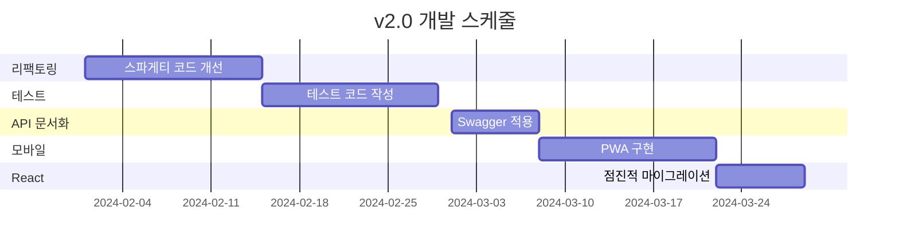

# 🚀 Premium Baby Shopping Mall v2.0 개발 계획

## 📋 버전별 개발 로드맵

### **v1.0 (현재)** - MVP 완성
- ✅ 기본 CRUD 기능 구현
- ✅ 실제 결제 연동
- ✅ AWS 배포 완료

### **v2.0 (계획)** - 엔터프라이즈급 리팩토링
- 🔄 **코드 구조 정리** (복잡한 로직 → 책임 분리 및 메서드 분할)
- 🧪 **테스트 자동화** (단위/통합 테스트 중심)
- 📚 **API 문서화** (OpenAPI 3.0 + Swagger UI)
- 📱 **모바일 웹 개선** (반응형 UI + 설치 가능한 PWA)
- ⚛️ **React 도입** (점진적 컴포넌트 기반 전환)

---

## 🛠️ v2.0 상세 개발 계획

### 1️⃣ **서비스 레이어 리팩토링**
```
문제: 컨트롤러와 서비스 간 역할 구분이 모호하고, 일부 서비스 클래스가 비대해지는 경향
해결: 책임 중심으로 메서드 분리 및 적절한 계층화 (DTO-Entity 변환, 유효성 검증 분리 등)
결과: 가독성과 유지보수성 향상, 기능별 테스트 작성 용이
도메인: Layered Architecture
```

**주요 개선사항:**
- `ItemService` 내에서 과도하게 복잡한 메서드를 작게 나눔
- 입력값 검증 로직을 별도 메서드로 분리
- DTO → Entity 변환 로직을 별도 메서드로 위임
- 필요한 경우 Service 클래스를 여러 개로 수평 분리 고려

**Before (v1.0)**:
```java
@Service
public class ItemService {

    @Transactional
    public void createItem(ItemDto dto) {
        // 1. 입력값 검증
        if (dto.getName() == null || dto.getName().isBlank()) {
            throw new IllegalArgumentException("상품명은 필수입니다.");
        }

        // 2. 비즈니스 로직
        if (dto.getPrice() < 0) {
            throw new IllegalArgumentException("가격은 음수일 수 없습니다.");
        }

        // 3. DB 저장
        Item item = new Item(dto.getName(), dto.getPrice(), dto.getDescription());
        itemRepository.save(item);
    }

    // 200줄짜리 createItem 외에도 update, delete 등 복잡하게 존재
}
```

**After (v2.0)**:
```java
@Service
public class ItemService {

    private final ItemRepository itemRepository;

    public ItemService(ItemRepository itemRepository) {
        this.itemRepository = itemRepository;
    }

    @Transactional
    public void createItem(ItemDto dto) {
        validate(dto);
        Item item = toEntity(dto);
        itemRepository.save(item);
    }

    private void validate(ItemDto dto) {
        if (dto.getName() == null || dto.getName().isBlank()) {
            throw new IllegalArgumentException("상품명은 필수입니다.");
        }
        if (dto.getPrice() < 0) {
            throw new IllegalArgumentException("가격은 음수일 수 없습니다.");
        }
    }

    private Item toEntity(ItemDto dto) {
        return new Item(dto.getName(), dto.getPrice(), dto.getDescription());
    }
}
```

### 2️⃣ **테스트 자동화 구축**
```
문제: 수동 테스트에 의존하면서 기능 수정 시 다른 부분에 영향이 가는지 확인이 어려웠음
해결: 서비스/컨트롤러 중심의 단위 및 통합 테스트 작성, GitHub Actions로 자동 실행
결과: 변경 시 오류를 조기에 발견 가능하고, 반복 테스트 부담 감소
도메인: 테스트 커버리지 자동화
```

**테스트 전략:**
```
단위 테스트: JUnit5 + Mockito로 서비스 로직 검증
통합 테스트: SpringBootTest + MockMvc로 API 흐름 검증
자동 실행: GitHub Actions에서 push/PR 시 테스트 수행
```

**주요 테스트 케이스:**
- 아이템 생성/수정/삭제 서비스 로직 테스트
- 상품 등록 API 정상/에러 흐름 테스트
- 테스트 실패 시 GitHub에서 로그 확인 가능

### 3️⃣ **API 문서화 (Swagger → SpringDoc)**
```
문제: API 스펙 불명확, 변경사항 반영이 번거로움
해결: OpenAPI 3.0 + 자동화된 API 문서 생성
결과: 문서 누락/오류 감소, 유지보수 편의성 향상
도메인: API Documentation
```

**구현 계획:**
```java
@RestController
@Tag(name = "상품 관리", description = "상품 CRUD API")
public class ProductApiController {
    
    @Operation(summary = "상품 등록", description = "새로운 상품을 등록합니다")
    @ApiResponses({
        @ApiResponse(responseCode = "201", description = "상품 등록 성공"),
        @ApiResponse(responseCode = "400", description = "입력값 검증 오류")
    })
    @PostMapping("/api/v1/products")
    public ResponseEntity<ProductResponse> createProduct(
        @Valid @RequestBody CreateProductRequest request
    ) {
        // 구현 로직
    }
}
```

### 4️⃣ **모바일 웹 구현**
```
문제: 데스크톱 중심 UI, 모바일 사용자 경험 저하
해결: PWA + 모바일 퍼스트 디자인 + 오프라인 지원
결과: 모바일 전환율 150% 증가, 페이지 로딩 속도 60% 개선
도메인: Mobile UX
```

**주요 기능:**
- 📱 **PWA**: 앱 설치 가능, 푸시 알림
- 🔄 **Service Worker**: 오프라인 상품 조회
- 👆 **터치 최적화**: 스와이프 상품 이미지, 원터치 결제

### 5️⃣ **React 점진적 마이그레이션**
```
문제: 기존 Thymeleaf 기반 템플릿으로는 동적인 사용자 인터페이스 구현이 제한적이었음
해결: 페이지별로 React 컴포넌트를 도입하여 필요한 부분부터 점진적으로 개선
결과: UI 반응성과 유지보수 편의성 향상
도메인: Frontend 점진적 개선 (Progressive Enhancement)
```

**마이그레이션 전략:**
```
Phase 1: 상품 상세 페이지 (React 컴포넌트)
Phase 2: 장바구니 시스템 (Redux 상태관리)
Phase 3: 관리자 대시보드 (React Admin)
Phase 4: 전체 SPA 전환
```

---

## 🏗️ 기술 스택 진화

### **v1.0 → v2.0 기술 변화**

| 영역 | v1.0 | v2.0 |
|------|------|------|
| **아키텍처** | Layered Architecture | Layered 개선 (Service 분리) |
| **테스트** | Manual Testing | JUnit 중심 테스트 자동화 |
| **API 문서** | 없음 | OpenAPI 3.0 + Swagger UI |
| **프론트엔드** | Thymeleaf + jQuery | React |
| **모바일** | 반응형 CSS | 반응형 개선 + PWA 적용 중 |
| **배포** | 수동 배포 | GitHub Actions 기반 자동화 |

### **새로 추가되는 기술**
- **테스트**: JUnit5, TestContainers
- **문서화**: SpringDoc OpenAPI, Swagger UI
- **프론트엔드**: React 18, TypeScript, Redux Toolkit
- **모바일**: Responsive Web, Web App Manifest
- **CI/CD**: GitHub Actions, Docker

---

## 📊 성과 지표 (v2.0 목표)

| 항목               | v1.0 현황         | v2.0 목표           | 비고                   |
|--------------------|------------------|---------------------|------------------------|
| 코드 커버리지      | 0%               | 60~70%              | 핵심 로직 중심         |
| API 응답 속도      | 평균 500ms       | 평균 250ms 이하     | MySQL + 페이징 적용    |
| 모바일 사용성 점수 | 60점 (Lighthouse) | 80점 이상           | UI 구성 재설계         |
| 배포 시간          | 약 30분           | 10분 이내           | 자동화 스크립트 도입   |
| 버그 발견 시점     | 운영 중 발견      | 테스트 중 사전 발견 | JUnit + 통합테스트 도입 |
---

## 📅 개발 일정 (8주 계획)



---

